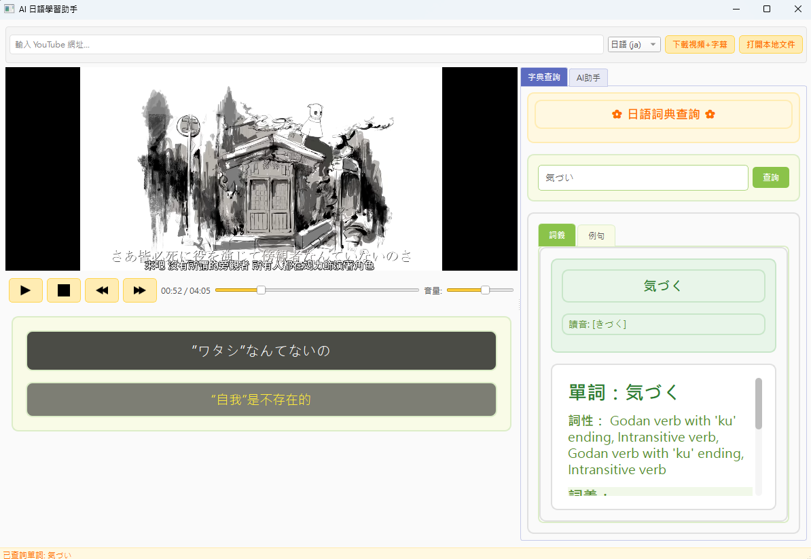
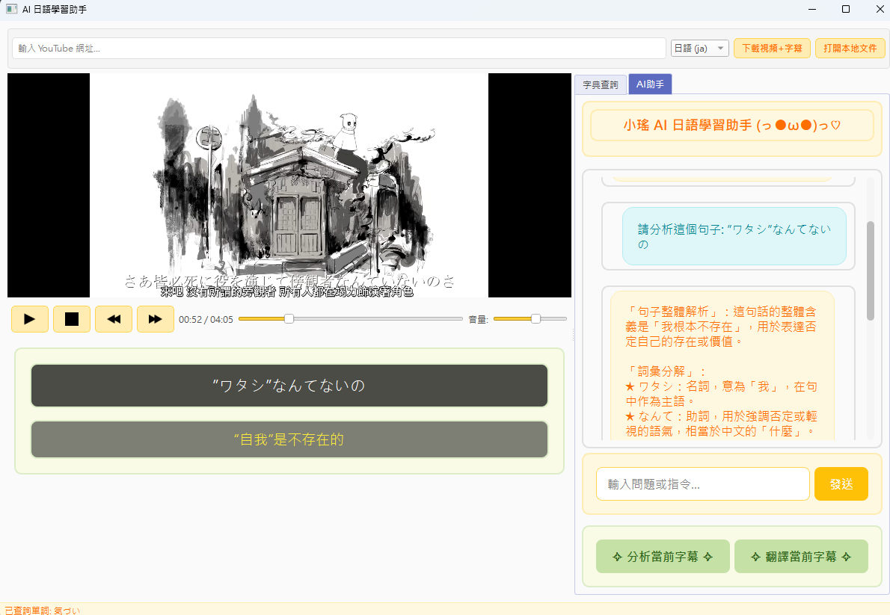

# AI 日語學習助手

一個功能強大的日語視頻學習工具，結合了視頻播放器、字幕顯示、字典查詢和 AI 助手功能，幫助您更有效地學習日語。

## 主要功能

### 🎬 視頻播放與字幕整合
- YouTube 視頻下載（帶有字幕）
- 本地視頻文件播放
- 自動同步日文與中文字幕
- 字幕時間軸調整功能

### 📚 即時字典查詢
- 單詞分析與詞性標註
- 詞義解釋和例句展示
- 漢字讀音顯示

### 🤖 AI 日語學習助手 "小瑤"
- 即時解答日語相關問題
- 分析字幕中的語法結構和用法
- 智能翻譯日文字幕
- 根據字幕上下文提供課程輔助

### 📱 直觀友好的用戶界面
- 分割式視圖顯示視頻和工具面板
- 可愛活潑的界面設計
- 完全支持繁體中文

## 創作動機
因為很喜歡聽日文歌，每次在聽歌的時候都想要學習歌詞的句型。還沒去了解MCP協議，但是就API串接上完全沒有問題，就製作了一個油油的日語歌詞學習助手「小瑤」~

## 產品演示


* 透過直接貼Youtube連結，可以在本地存下影片，並且會有中日字幕對照歌曲。隨時都可以調用字典功能查詢單字


* 此處也可以改使用OpenAI 的API串聯，讓AI即時直接分析句型文法。

## 環境設置

### 系統要求
- Python 3.6 或更高版本
- Windows, macOS 或 Linux 系統
- VLC 媒體播放器（用於視頻播放）

### 安裝步驟

1. 克隆或下載本項目到本地目錄
   ```bash
   git clone https://github.com/xingting1026/AI-JPsong-assistant.git
   cd japanese-ai-assistant
   ```

2. 創建並激活虛擬環境（可選但推薦）
   ```bash
   # Windows
   python -m venv venv
   venv\Scripts\activate

   # macOS/Linux
   python -m venv venv
   source venv/bin/activate
   ```

3. 安裝依賴庫
   ```bash
   pip install PyQt6 webvtt-py python-vlc yt-dlp requests fugashi
   ```

4. 如果要啟用單詞分析功能，安裝日語分詞庫（可選）
   ```bash
   pip install fugashi[unidic]
   # 或者對於較大的詞典
   pip install fugashi[unidic-lite]
   ```

5. 設置 OpenAI API 密鑰
   在 `ai_assistant.py` 文件中，將 `self.api_key` 替換為您自己的有效 OpenAI API 密鑰，或者使用環境變量。

### 安裝 VLC 媒體播放器
此程序依賴 VLC 媒體播放器作為視頻播放引擎。請確保您的系統已安裝 VLC：

- Windows: [https://www.videolan.org/vlc/download-windows.html](https://www.videolan.org/vlc/download-windows.html)
- macOS: [https://www.videolan.org/vlc/download-macosx.html](https://www.videolan.org/vlc/download-macosx.html)
- Linux: 使用系統包管理器安裝，例如 `apt install vlc` 或 `pacman -S vlc`

## 啟動應用程序

運行主程序文件：
```bash
python main.py
```

## 使用方法

### 下載 YouTube 視頻
1. 在頂部工具欄的輸入框中貼上 YouTube 視頻的 URL
2. 選擇字幕語言（日語、英語或韓語）
3. 點擊「下載視頻+字幕」按鈕
4. 等待下載完成後，視頻會自動加載

### 打開本地視頻
1. 點擊「打開本地文件」按鈕
2. 在文件選擇對話框中選擇視頻文件（支持 mp4, mkv, avi, mov 等格式）
3. 程序會自動尋找同名的字幕文件（.ja.vtt, .zh-TW.vtt 等）

### 使用字典查詢
1. 在字典查詢標籤頁中，輸入要查詢的日語單詞
2. 點擊「查詢」按鈕或按 Enter 鍵
3. 查詢結果將顯示在「詞義」和「例句」標籤頁中

### 與 AI 助手互動
1. 切換到「AI 助手」標籤頁
2. 在輸入框中輸入問題或指令
3. 點擊「發送」按鈕或按 Enter 鍵發送消息
4. AI 助手「小瑤」會回答您的問題

### 常用 AI 助手功能
- **分析當前字幕**：點擊「分析當前字幕」按鈕，AI 會分析當前顯示的日語字幕的語法結構
- **翻譯當前字幕**：點擊「翻譯當前字幕」按鈕，AI 會提供當前字幕的翻譯和文化背景解釋
- **日語學習問答**：詢問有關日語語法、詞彙、文化等任何問題

## 注意事項

1. **API 密鑰安全**：請勿公開分享您的 OpenAI API 密鑰，建議使用環境變量或配置文件。

2. **YouTube 下載**：請確保遵守 YouTube 的使用條款和版權規定，僅下載您有權訪問的內容。

3. **字幕格式**：本程序支持 VTT 格式的字幕文件，其他格式可能需要轉換。

4. **VLC 媒體播放器**：如果遇到視頻播放問題，請確保已正確安裝 VLC 且版本兼容。

5. **日語分詞器**：為了啟用完整的單詞分析功能，需要安裝 fugashi 和 unidic 詞典。

## 功能模塊說明

本程序由以下主要模塊組成：

- **app_UI.py**: 主界面和應用程序架構
- **media_player.py**: 基於 VLC 的視頻播放器
- **subtitle_processor.py**: 字幕處理和分析
- **dictionary_widget.py**: 日語字典查詢界面
- **ai_assistant.py**: OpenAI API 集成的 AI 助手
- **ai_chat_widget.py**: AI 聊天界面
- **data_manager.py**: 數據管理，包括視頻下載
- **paths.py**: 路徑管理工具

## 問題排解

1. **VLC 模塊缺失**：出現「無法導入 vlc 模組」錯誤時，請確保已安裝 python-vlc 和 VLC 媒體播放器。

2. **API 請求錯誤**：確保您的 OpenAI API 密鑰有效且有足夠額度。

3. **字幕不同步**：程序會嘗試自動同步日文和中文字幕，但對於某些視頻可能需要手動調整。

4. **視頻播放問題**：如果視頻無法播放，請嘗試使用不同格式的視頻文件或更新 VLC 版本。

5. **字典查詢失敗**：網絡問題可能導致字典查詢失敗，請檢查網絡連接。

## 貢獻與支持

若您發現任何問題或有改進建議，歡迎提交 issue 或 pull request。

## 授權協議

本項目採用 MIT 授權協議。

---

*注意：本程序需要穩定的網絡連接以使用 AI 功能和字典查詢。*